# WhatsAgent: AI-Powered Multi-Tenant WhatsApp SaaS Platform 🤖

> **WhatsAgent** is an enterprise-grade, multi-tenant B2B SaaS platform that enables businesses to deploy autonomous AI agents on WhatsApp. Built with **LangGraph**, **Groq (Llama 3.1/3.3)**, and the **Meta WhatsApp Cloud API**, it seamlessly handles customer inquiries, performs Retrieval-Augmented Generation (RAG) using business catalogs and PDFs, and provides a beautiful dashboard for live human oversight.

---

## 🎯 Value Proposition & Core Features

- **Multi-Tenant Architecture**: Host multiple isolated businesses (tenants) under a single deployment. Each tenant gets their own unique persona, knowledge base, and dashboard view.
- **Autonomous RAG Agent**: An advanced LangGraph pipeline processes inbound messages, semantically searches the tenant's vector database (ChromaDB), and generates highly accurate, context-aware responses using Groq.
- **Intelligent Tool Calling**: The agent can autonomously decide to query the product catalog, attach PDF documents from the Media Library, or seamlessly escalate complex queries to a human agent.
- **Real-Time Human Handoff**: The React/Vite dashboard features a live unified inbox. When the AI escalates a chat, agents receive instant notifications and can take over the conversation directly through the platform.
- **Multimodal Capabilities**: Capable of processing inbound images using Gemini Vision and attaching dynamic documents/images to outbound messages.

---

## 🏗️ System Architecture & Workflow

The platform leverages an asynchronous, event-driven architecture to ensure webhook endpoints respond within Meta's stringent timeout limits, while complex LLM reasoning happens reliably in the background.

```mermaid
sequenceDiagram
    participant Customer
    participant Meta API
    participant FastAPI
    participant LangGraph
    participant ChromaDB
    participant Groq LLM
    participant Dashboard

    Customer->>Meta API: Sends Message (Text/PDF)
    Meta API->>FastAPI: Webhook POST Event
    FastAPI-->>Meta API: 200 OK (Instant Ack)
    FastAPI->>LangGraph: Spawn Background Task
    
    rect rgb(22, 27, 34)
        note right of LangGraph: Autonomous Agent Pipeline
        LangGraph->>Meta API: Dispatch Read Receipt & Typing...
        LangGraph->>ChromaDB: Semantic Search (Query)
        ChromaDB-->>LangGraph: Retrieved RAG Chunks
        LangGraph->>Groq LLM: System Prompt + History + Context
        Groq LLM-->>LangGraph: Tool Calls (Search/Get Media/Escalate)
        LangGraph->>Groq LLM: Execute Tools & Re-prompt
        Groq LLM-->>LangGraph: Final Conversational Reply
    end
    
    LangGraph->>Meta API: Dispatch Reply / Send PDF Attachment
    Meta API->>Customer: Message Delivered
    LangGraph->>FastAPI: Update MongoDB Session State
    FastAPI->>Dashboard: Real-Time Sync (Live Chats)
    
    alt Human Handoff Triggered
        Groq LLM-->>LangGraph: Call `escalate_to_human`
        LangGraph->>FastAPI: Set session to NEEDS_HUMAN
        FastAPI->>Dashboard: Ring Notification Bell
        Dashboard->>Meta API: Human Agent Replies Manually
    end
```



---

## 🧠 LangGraph Schema & Architectural Breakdown

The AI core of WhatsAgent is built upon a deterministic state machine using **LangGraph**. This ensures predictable, highly observable agent behavior instead of relying on unpredictable black-box agentic loops.

### State Representation (`AgentState`)
The agent's memory for a single execution loop is strictly typed. Key components include:
- `tenant_id` & `session_id`: Identifiers for the conversation context.
- `inbound_text` & `inbound_media_*`: The raw message or image/PDF sent by the user.
- `chat_history`: The last 5 turns of the conversation fetched from MongoDB.
- `rag_chunks`: Semantic context retrieved from ChromaDB.
- `llm_reply` & `media_to_send`: The final output destined for the Meta WhatsApp API.
- `session_status`: Enum (`WAITING_FOR_BOT`, `AGENT_RESPONDING`, `NEEDS_HUMAN`) controlling human handoff.

### Nodes and Edges
The graph is designed as a direct pipeline with 4 distinct nodes:

1. **`acknowledge_node`**
   - **Action**: Immediately sends a WhatsApp "Read Receipt" and "Typing..." indicator.
   - **State Mutation**: Logs the inbound message to MongoDB and marks the session as `AGENT_RESPONDING`.
   - **Edge**: Flows directly to `context_retriever_node`.

2. **`context_retriever_node`**
   - **Action**: Queries ChromaDB (RAG) based on the customer's text. If the customer sent an image, it queries Gemini 2.0 Flash to generate a vision description. If they sent a PDF, it chunks and embeds the PDF dynamically.
   - **State Mutation**: Injects `rag_chunks`, `catalog_names`, and `chat_history` into the state.
   - **Edge**: Flows to `llm_reasoning_node`.

3. **`llm_reasoning_node`**
   - **Action**: Assembles a massive system prompt (Persona + RAG Chunks + Media Availability + Conversation History). Calls Groq (Llama 3.1/3.3) for reasoning and tool calling (`search_catalog`, `get_media`, `escalate_to_human`).
   - **State Mutation**: Finalizes the text generation in `llm_reply` and assigns any requested PDF/Images to `media_to_send`. Alters `session_status` if the human escalation tool is called.
   - **Edge**: Flows to `dispatcher_node`.

4. **`dispatcher_node`**
   - **Action**: Executes the final HTTP requests to the Meta Cloud API to deliver the text and media.
   - **State Mutation**: Saves the outbound log to MongoDB, increments message counts, and resets the session status to `WAITING_FOR_BOT` (unless escalated).
   - **Edge**: END.

---

## 🚀 Local Development & Quick Start

Follow these instructions to run the full stack locally for development or testing.

### Prerequisites
- **Python 3.11+**
- **Node.js 18+**
- **MongoDB**: A local instance (`localhost:27017`) or an Atlas Cluster URI.
- **API Keys**: Groq (for LLM reasoning), Gemini (for Vision), and Meta (for WhatsApp Cloud API).

### 1. Environment Configuration (`.env`)
First, copy the example environment file:
```bash
cp backend/.env.example backend/.env
```

Open `backend/.env` and configure the following required variables:

```env
# Database Connections
MONGO_URI=mongodb://localhost:27017/  # Or your MongoDB Atlas URI
MONGO_DB_NAME=whatsapp_agent

# Meta WhatsApp Cloud API (From Facebook Developer Portal)
META_PHONE_NUMBER_ID=your_phone_number_id
META_ACCESS_TOKEN=your_permanent_access_token
META_VERIFY_TOKEN=your_custom_verify_string
META_APP_SECRET=your_app_secret

# AI Models
GROQ_API_KEY=gsk_your_groq_key
GROQ_MODEL=llama-3.1-8b-instant

GEMINI_API_KEY=AIzaSy_your_gemini_key
GEMINI_MODEL=gemini-2.0-flash

# System Settings
ADMIN_PASSWORD=your_dashboard_password
APP_BASE_URL=http://localhost:8000
```

### 2. Run the Backend (FastAPI)
The backend is a FastAPI server that handles webhooks and runs the LangGraph agent asynchronously.

```bash
cd backend
python -m venv .venv
source .venv/bin/activate  # On Windows: .venv\Scripts\activate
pip install -r requirements.txt

# Start the uvicorn development server
uvicorn app.main:app --reload
```
*The API and Swagger documentation will be available at `http://localhost:8000/docs`*

### 3. Run the Frontend Dashboard (React + Vite)
The frontend is a React Single Page Application (SPA) styled with TailwindCSS.

```bash
cd frontend
npm install

# Create a local .env file pointing to the backend
echo "VITE_API_BASE_URL=http://localhost:8000" > .env

# Start the Vite development server
npm run dev
```
*The SaaS dashboard will be available at `http://localhost:5173`. You can log in using the `ADMIN_PASSWORD` defined in your backend `.env`.*

---

## 🌍 Deployment Environment Details

For production, the application is designed to be deployed as separated microservices using **Render**, **Railway**, or **AWS/GCP**.

### Chosen Deployment Architecture

#### 1. Backend (FastAPI via Render/Railway)
The backend requires a persistent environment to maintain the ChromaDB vector files locally (or it must connect to a managed vector DB).
- **Hosting**: Render Web Service (Python environment) or Railway Docker deployment.
- **Start Command**: `uvicorn app.main:app --host 0.0.0.0 --port $PORT`
- **Networking**: The backend URL MUST be exposed to the public internet using HTTPS so that Meta's servers can deliver webhook POST requests to `/api/webhooks/whatsapp`.

#### 2. Frontend (Vite SPA via Vercel/Netlify)
The frontend is purely static HTML/JS/CSS once built.
- **Hosting**: Vercel, Netlify, or AWS S3 + CloudFront.
- **Build Command**: `npm run build`
- **Environment**: During the build step, `VITE_API_BASE_URL` MUST be set to the production URL of the deployed FastAPI backend.

#### 3. Databases (MongoDB Atlas)
- We utilize **MongoDB Atlas** (cloud-hosted MongoDB) for all persistence to ensure horizontal scalability across multiple backend workers.
- **GridFS** is heavily utilized within MongoDB to act as a Blob store for caching incoming WhatsApp images and hosted PDF catalogs, ensuring statelessness in the backend container.

### Webhook Configuration (Going Live)
Once deployed, log into the **Meta Developer Portal**:
1. Navigate to **WhatsApp > Configuration**.
2. Set the Webhook URL to `https://<your-deployed-backend-url>/api/webhooks/whatsapp`.
3. Set the Verify Token to match the `META_VERIFY_TOKEN` you placed in your `.env`.
4. Subscribe strictly to the **messages** webhook event.

---

## 📂 Database Schema Overview

| Collection | Purpose |
|---|---|
| `tenants` | Multi-tenant configurations, agent personas, and phone number IDs. |
| `chat_sessions` | Active and historical session metadata, unread counts, and statuses (`WAITING_FOR_BOT`, `NEEDS_HUMAN`, `RESOLVED`). |
| `message_audit_log` | Append-only ledger of every inbound and outbound message for compliance and dashboard rendering. |
| `knowledge_docs` | Reference pointers for PDF documents ingested into the ChromaDB vector space. |
| `catalog_items` | E-commerce product entries, descriptions, and media pointers. |
| `customer_routing` | Maps individual customer phone numbers to specific tenant workspaces. |
| `processed_webhooks` | Idempotency store to prevent duplicate replies if Meta retries a webhook delivery. |

---

## 📝 License
Proprietary / MIT (Depending on deployment strategy).
