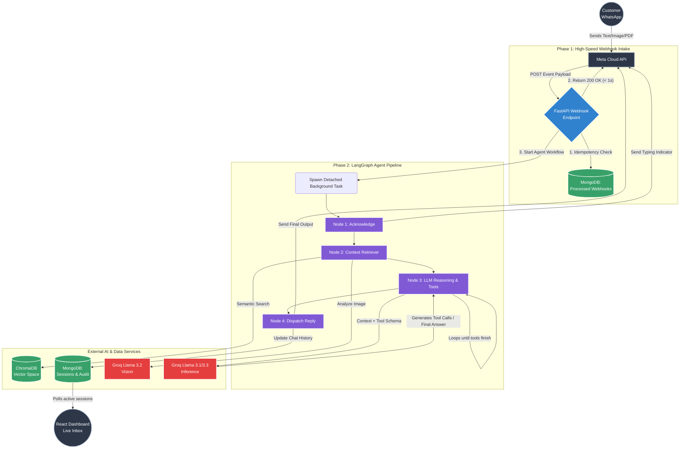

# WhatsAgent: Multi-Tenant Agentic WhatsApp Orchestrator 🤖

> **WhatsAgent** is my submission for the AI Engineer assessment: an enterprise-grade, multi-tenant SaaS platform that allows businesses to deploy autonomous AI support and sales agents on WhatsApp. 

Built heavily around **LangGraph**, **Groq (Llama 3.1 & 3.3 Vision)**, and the **Meta WhatsApp Cloud API**, this platform transcends a simple chatbot script. It is designed with a cloud-native, asynchronous architecture capable of handling concurrent multi-tenant webhook traffic, executing Retrieval-Augmented Generation (RAG) over business catalogs/PDFs, and providing a beautiful React dashboard for live human oversight.

---

## 🎯 How the Assignment Requirements Were Met

I approached this assignment with a focus on production reliability and architectural foresight, ensuring every core requirement and bonus objective was strictly met:

1. **Multi-Tenant Architecture**: A single backend instance hosts infinite isolated businesses. The system intelligently routes inbound customer messages to the correct tenant context, knowledge base, and vector space simply by checking the Meta `whatsapp_phone_number_id`.
2. **Autonomous LangGraph Agent**: Inbound text and media are passed through a strict, deterministic 4-node LangGraph state machine, drastically reducing the hallucination and looping issues common in naive ReAct agent loops. 
3. **Rich Responses & Tool Calling**: The agent autonomously decides when to query the ChromaDB vector index, attach PDF documents from the Blob store (Media Library), or retrieve images from the product catalog.
4. **Real-Time Human Handoff**: The React/Vite dashboard features a live unified inbox. The UI instantly updates via DB polling when an agent escalates a chat.
5. **Bonus 1 (Webhook Security)**: Implemented cryptographic HMAC SHA-256 validation in the webhook router (`X-Hub-Signature-256`) to guarantee payloads genuinely originate from Meta.
6. **Bonus 2 (Multimodal Vision)**: When a customer sends an image, the pipeline dynamically passes the bytes to **Groq Llama 3.2 Vision** to generate a semantic description, which is instantly injected into the LLM conversational state.
7. **Bonus 3 (Sentiment Escalation)**: The system prompt actively monitors user sentiment. If a user exhibits frustration, the LLM autonomously triggers the `escalate_to_human` tool, halting auto-replies and flagging the conversation red on the dashboard.

---

## 🏗️ System Architecture & LangGraph Breakdown

The platform leverages an asynchronous, event-driven architecture to ensure webhook endpoints respond within Meta's stringent timeout limits, while complex LLM reasoning happens reliably in the background.



### LangGraph Schema: State, Nodes, and Edges

To prevent unpredictable black-box loops, the AI core is built on a deterministic state machine.

#### State Representation (`AgentState`)
The agent's memory for a single execution loop is strictly typed in Python via `TypedDict`. Key components include:
* **Context Identifiers**: `tenant_id` & `session_id`. Used for routing and DB lookups.
* **Inbound Payloads**: `inbound_text` & `inbound_media_type` (raw messages, images, PDFs).
* **Injected Context**: `chat_history` (MongoDB), `rag_chunks` (ChromaDB), and `inbound_image_description` (Groq Vision output).
* **Outbound Generation**: `llm_reply` & `media_to_send` (the final output destined for Meta).
* **Lifecycle Enum**: `session_status` (`WAITING_FOR_BOT`, `AGENT_RESPONDING`, `NEEDS_HUMAN`) controlling human handoff.

#### Nodes and Edges
The graph is designed as a direct pipeline with 4 distinct nodes:

1. **`acknowledge_node`**
   - **Action**: Instantly fires a WhatsApp "Read Receipt" and "Typing..." indicator to reduce user drop-off while the LLM thinks.
   - **Edge**: Flows directly to `context_retriever_node`.
2. **`context_retriever_node`**
   - **Action**: Queries ChromaDB (RAG) based on the customer's text. If the customer sent an image, it halts to query Groq Vision to generate a description.
   - **Edge**: Flows to `llm_reasoning_node`.
3. **`llm_reasoning_node`**
   - **Action**: Assembles a massive context window (Persona + RAG Chunks + Media Availability + Conversation History). Calls Groq for reasoning and tool calling (`search_catalog`, `get_media`, `escalate_to_human`).
   - **Edge**: Flows to `dispatcher_node`.
4. **`dispatcher_node`**
   - **Action**: Executes the final HTTP requests to the Meta API to deliver text and rich media, and saves the outbound audit log to MongoDB.
   - **Edge**: END.

---

## 🛠️ Key Design Decisions & Trade-offs

During development, several crucial engineering decisions were made to prioritize speed, reliability, and enterprise scale:

1. **FastAPI Background Tasks**: Meta's webhook system strictly demands a `200 OK` response within a few seconds, otherwise it will drop the webhook and retry later. Because LangGraph LLM inference can take 2-4 seconds, processing the webhook synchronously is dangerous. I utilized FastAPI `BackgroundTasks` to instantly respond to Meta, while the LangGraph pipeline executes in a detached async thread.
2. **Idempotency with MongoDB**: Because webhooks can occasionally double-fire over the network, I implemented a `processed_webhooks` collection. By storing every incoming `message_id`, the system performs an atomic check. If a duplicate webhook arrives, it is safely ignored, preventing the LLM from spamming the customer twice.
3. **MongoDB GridFS over AWS S3**: To simplify the deployment footprint and reduce vendor lock-in for this assessment, I opted to use MongoDB GridFS as the primary Blob store for PDF catalogs and customer images. This ensures the backend containers remain entirely stateless and horizontally scalable without needing external S3 buckets.
4. **Groq Inference**: Instead of defaulting to OpenAI GPT-4o, I integrated Groq's Llama 3.1 and 3.2 Vision models. Groq's LPU architecture provides blazing-fast time-to-first-token (TTFT), which is critical for real-time messaging environments like WhatsApp where high latency causes user abandonment.

---

## 🚀 Quick-Start: Setting up Environment Variables

To run this platform, you will need a Meta Developer Account, a Groq API Key, and a MongoDB instance (local or Atlas).

Create a `.env` file inside the `backend` folder and populate it with the following required variables:

```env
# Database Connections
MONGO_URI=mongodb://localhost:27017/  # Or your MongoDB Atlas URI
MONGO_DB_NAME=whatsapp_agent

# Meta WhatsApp Cloud API (From Facebook Developer Portal)
# NOTE: Ensure your personal phone number is added to the "To" field in Meta's API setup!
META_PHONE_NUMBER_ID=your_phone_number_id
META_ACCESS_TOKEN=your_permanent_or_temporary_access_token
META_VERIFY_TOKEN=your_custom_verify_string  # You make this up (e.g. whatsagent@123)
META_APP_SECRET=your_app_secret  # Required for X-Hub-Signature-256 Webhook Security

# AI Models (Fast & Free Tier via Groq)
GROQ_API_KEY=gsk_your_groq_key
GROQ_MODEL=llama-3.1-8b-instant

# System Settings
ADMIN_PASSWORD=your_dashboard_password
APP_BASE_URL=http://localhost:8000
```

---

## 💻 Step-by-Step Instructions to Run Locally

### 1. Run the Backend (FastAPI)
The backend is a FastAPI server that handles Meta webhooks, processes the LangGraph pipeline, and hosts the API for the dashboard.

```bash
cd backend
python -m venv .venv
source .venv/bin/activate  # On Windows: .venv\Scripts\activate
pip install -r requirements.txt

# Start the uvicorn development server
uvicorn app.main:app --reload
```
*The API and Swagger documentation will be available at `http://localhost:8000/docs`*

### 2. Run the Frontend Dashboard (React + Vite)
The frontend is a React Single Page Application (SPA) styled with TailwindCSS.

```bash
cd frontend
npm install

# Create a local .env file pointing to your backend
echo "VITE_API_BASE_URL=http://localhost:8000" > .env

# Start the Vite development server
npm run dev
```
*The SaaS dashboard will be available at `http://localhost:5173`. Log in using the `ADMIN_PASSWORD` defined in your backend `.env`.*

---

## 🌍 Chosen Deployment Environment & Setup Details

For production, the application is intentionally designed to be deployed as separated microservices to ensure stability and horizontal scalability.

### 1. Backend (FastAPI via Render / Railway)
The backend requires a persistent environment to execute background tasks reliably and maintain ChromaDB vector bindings.
- **Hosting**: Render Web Service (Python) or a Railway Docker deployment.
- **Start Command**: `uvicorn app.main:app --host 0.0.0.0 --port $PORT`
- **Networking Requirement**: The backend URL MUST be exposed to the public internet using HTTPS so that Meta's servers can deliver webhook POST requests to `/api/webhooks/whatsapp`.

### 2. Frontend (Vite SPA via Vercel / Netlify)
The frontend is purely static HTML/JS/CSS once built, making edge-network deployment optimal for low-latency dashboard loads.
- **Hosting**: Vercel or Netlify.
- **Build Command**: `npm run build`
- **Setup Detail**: During the deployment build step on Vercel, the `VITE_API_BASE_URL` Environment Variable MUST be set to the production URL of the deployed FastAPI backend (e.g. `https://my-backend-render.com`).

### 3. Database (MongoDB Atlas)
- **Hosting**: MongoDB Atlas (cloud-hosted MongoDB).
- **Design Choice**: Utilizing a centralized cloud database allows for horizontal scaling of the backend workers. If traffic spikes, Render can spin up 5 backend instances, and they will all seamlessly share state via Atlas and GridFS.

### 4. Meta Webhook Configuration (Going Live)
Once deployed, the Meta portal must be configured to point to the live server:
1. Navigate to **WhatsApp > Configuration** in the Meta Developer Portal.
2. Click Edit next to Webhook.
3. Set the Callback URL to `https://<your-deployed-backend-url>/api/webhooks/whatsapp`.
4. Set the Verify Token to match the `META_VERIFY_TOKEN` you placed in your Render environment variables.
5. Under "Webhook fields", click **Manage** and subscribe strictly to the **messages** event.

---

## 📂 Database Schema Overview

| Collection Name | Architecture Purpose |
|-----------------|----------------------|
| `tenants` | Core multi-tenant configurations. Stores agent personas, brand details, and unique Meta phone number IDs for webhook routing. |
| `chat_sessions` | Stores active and historical session metadata, including unread counts and the critical `session_status` enum (`WAITING_FOR_BOT`, `NEEDS_HUMAN`, `RESOLVED`). |
| `message_audit_log` | An append-only ledger of every inbound and outbound message. Used for rendering the Live Inbox in the dashboard and compliance auditing. |
| `knowledge_docs` | Reference pointers for PDF documents ingested into the ChromaDB vector space. |
| `catalog_items` | Structured e-commerce product entries containing AI-generated visual descriptions and media pointers. |
| `customer_routing` | A KV map connecting individual customer phone numbers to specific tenant workspaces. |
| `processed_webhooks` | The idempotency store. Tracks unique Meta message IDs to prevent duplicate LLM processing if Meta forcibly retries a webhook delivery. |

---

## 📝 License
Proprietary / MIT (Depending on final deployment strategy).
